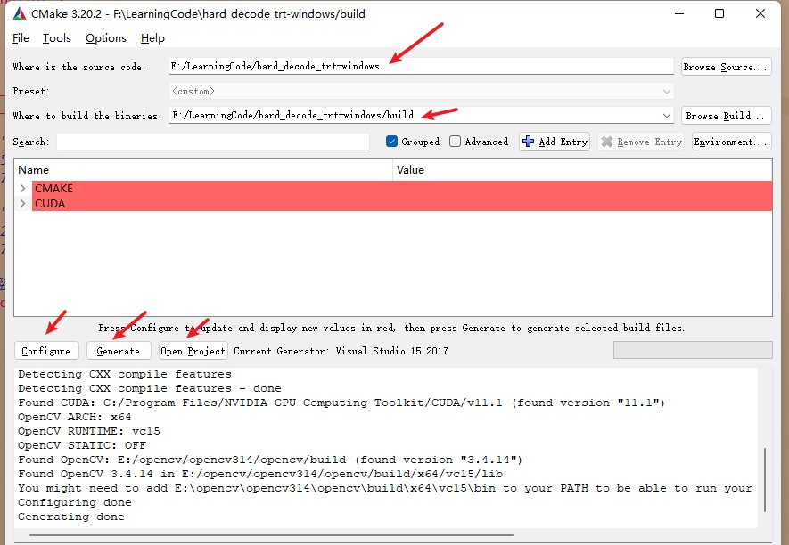
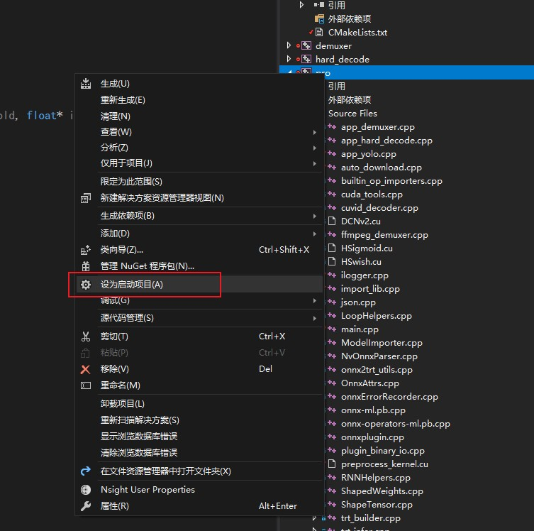
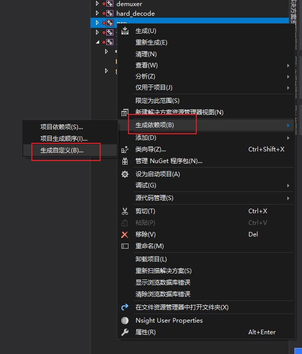
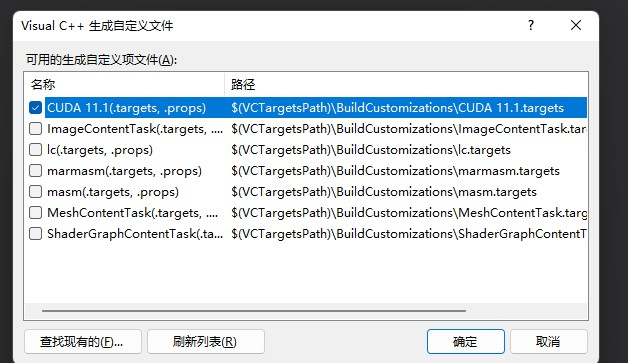
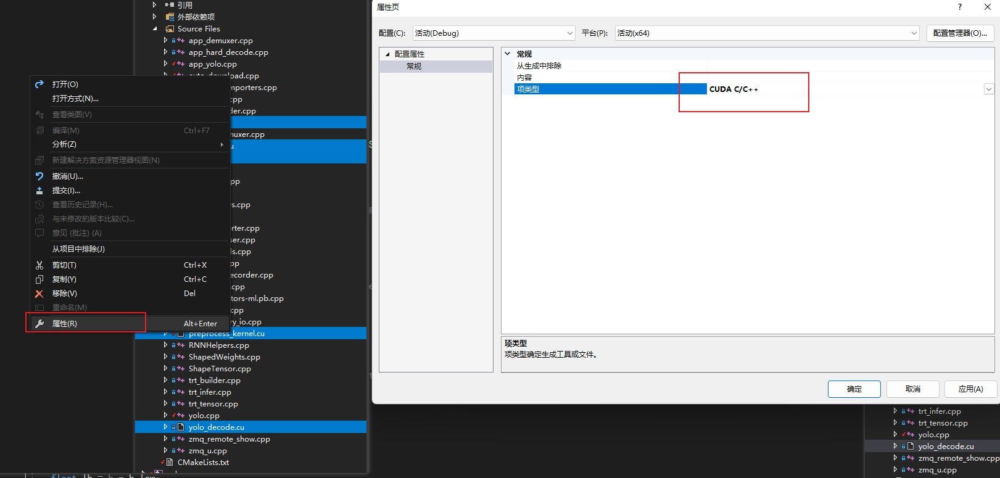
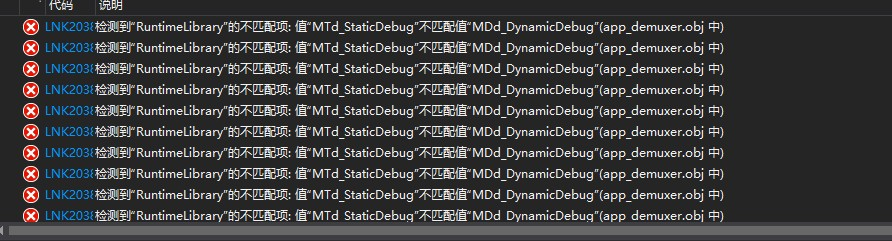
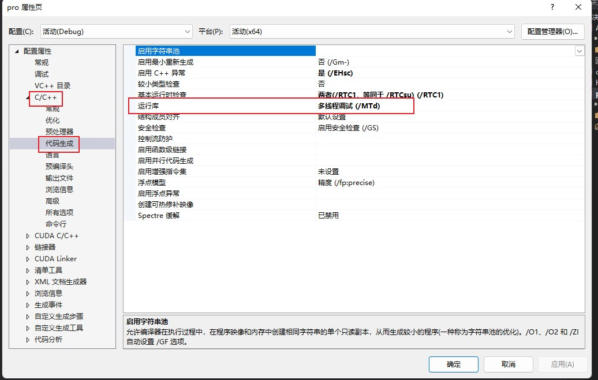

# 硬件解码配合TensorRT

- 配置tensorRT一样的环境
- 增加NVDEC和ffmpeg的配置
- `make yolo -j64`
  - Yolo和硬件解码直接对接
- `make demuxer -j64`
  - 仅仅解封装得到h264的包，并分析是什么帧
- `make hard_decode -j64`
  - 硬件解码测试
- 软解码和硬解码，分别消耗cpu和gpu资源。在多路，大分辨率下体现明显
- 硬件解码和推理可以允许跨显卡
- 理解并善于利用的时候，他才可能发挥最大的效果
* 原版的仓库：[shouxieai/hard_decode_trt: Yolov5 inference on NVDec hardware decoder (github.com)](https://github.com/shouxieai/hard_decode_trt)

## window编译流程

* 安装ffmpeg 
  
  * [zeranoe directory listing (archive.org)](https://archive.org/download/zeranoe/win64/dev/)
  
  * 我选择的是 [ffmpeg-4.2.2-win64-dev.zip](https://archive.org/download/zeranoe/win64/dev/ffmpeg-4.2.2-win64-dev.zip)

* 安装NVDEC
  
  * 从官网下载 [Video Codec SDK Archive | NVIDIA Developer](https://developer.nvidia.com/video-codec-sdk-archive)
  
  * 注意:这个API对驱动版本号有要求， 所以要看本机的驱动在下载相关的版本
    
    * 我这里用的10.0版本
      
      * Windows: Driver version 445.87 or higher

* 修改cmakelists中的 13-30行的路径

* cmake-gui生成工程。
  
  

* 打开工程后，需要设置一下:  将pro设置为启动项
  
  

* 设置cuda环境
  
  

* 选中pro中的 所有cu文件，右键属性 cuda编译
  
  

* 如果遇到下面的错误
  
  
  
  在pro属性页 设置运行时
  
  

* 最后编译 ，将 tensorrt  nvdec opencv等的dll拷贝到exe同级目录，就可以运行了